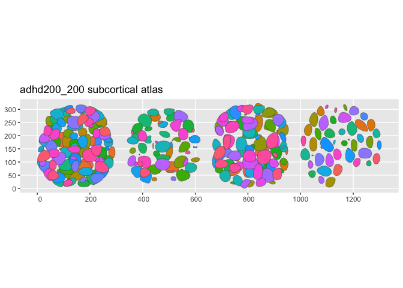
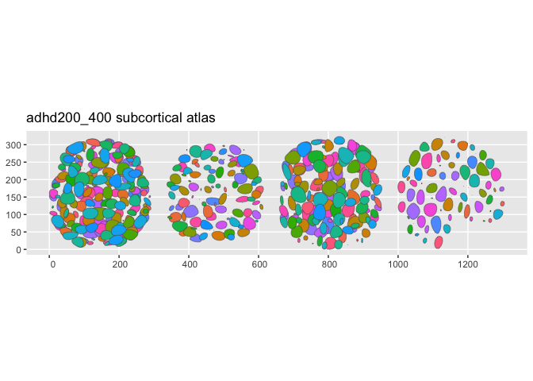

<!-- README.md is generated from README.Rmd. Please edit that file -->

# ggsegAdhd200

<!-- badges: start -->

[](https://github.com/ggsegverse/ggsegAdhd200/actions/workflows/R-CMD-check.yaml)
[](https://ggsegverse.r-universe.dev/ggsegAdhd200)
<!-- badges: end -->

ADHD-200 Parcellation Atlases for the ggsegverse Ecosystem.

## Installation

``` r
# From r-universe
install.packages("ggsegAdhd200", repos = "https://ggsegverse.r-universe.dev")

# From GitHub
# install.packages("remotes")
remotes::install_github("ggsegverse/ggsegAdhd200")
```

## Atlases

### adhd200_200

Craddock CC200 parcellation (190 regions).

``` r
library(ggsegAdhd200)
plot(adhd200_200())
```



### adhd200_400

Craddock CC400 parcellation (351 regions).

``` r
plot(adhd200_400())
```


\## Data source

[NITRC](https://www.nitrc.org/frs/?group_id=427).

- **Reference**: Craddock et al. (2012)
  [doi:10.1002/hbm.21333](https://doi.org/10.1002/hbm.21333)
- **Date obtained**: 2026-03-28
